headlines 4

<span id="top"></span> [&lt; Home](../index.org)

Implementing Deferred Shading in Metal
======================================

Introduction
============

Deferred shading is a rendering technique usually used to optimize scenes with a large number of light sources. Rather than perform expensive lighting calcuations on every fragment in the scene, we 'defer' the lighting calculations to a later time, when we know which fragments are affected by which lights.

Process
=======

The process of my particular implementation of deferred shading is as follows:

We first render the scene in what is known as the 'Geometry Buffer' or 'GBuffer' pass, where we gather information about a scene (such as albedo, normal, depth and position information) and render it to separate textures.

*The position, normal, world position and depth of a simple scene are shown below. Note that the normal and position textures look the same because the sphere is positioned at (0, 0, 0) and hence the position of each fragment is equivalent to that fragment's normal.*

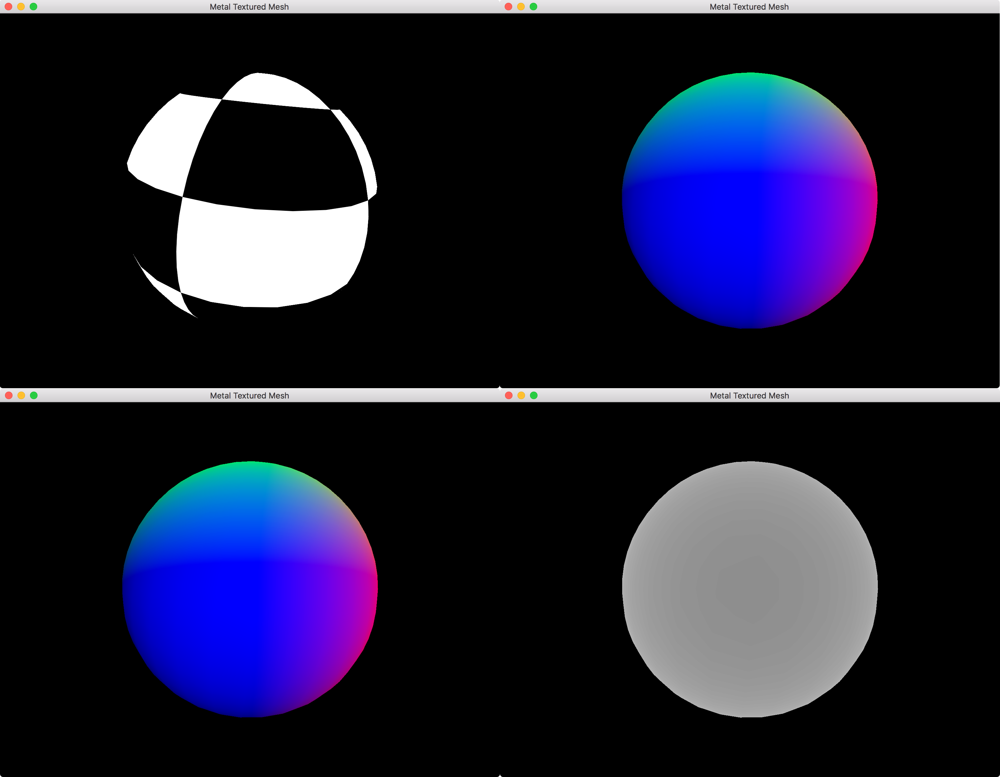

Next, we render the light volumes in the scene. The light volumes are pieces of geometry chosen to mimic the area-of-effect of a particular light. For example, a point light can be represented by a sphere mesh. The radius of the sphere mesh should be such that the light contribution provided by that light at the edge of the mesh be 0.

*A visualization of the lights in the example scene:*

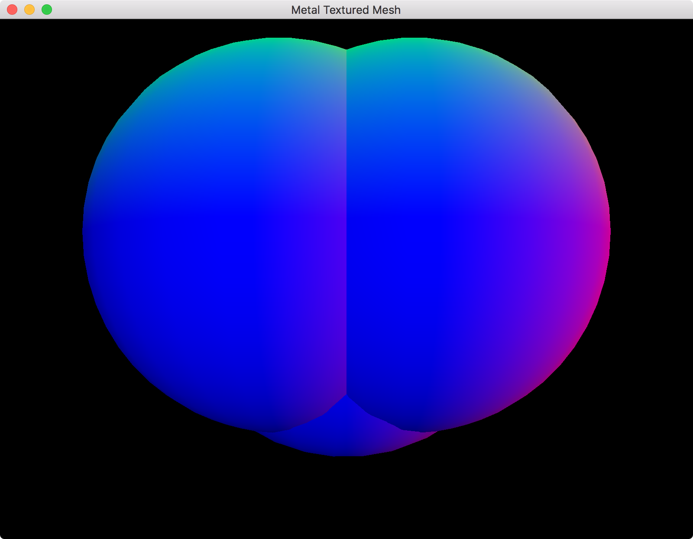

When we render the light volumes, we use the GBuffer pass's unmodified depth texture as as the render pass's depth texture, this allows us to compare the depth of the light volumes with the scene depth. We also render both the front and back faces of the light volume. If a front-face fails the depth test, we increment the stencil buffer value at that point. If a back-face fails the depth test, we decrement the stencil buffer value at that point. This way, fragments within a light volume have a value of 1 in the stencil buffer and all other fragments have a value of 0 (A visual explanation of this stencil buffer algorithm can be found [here](http://ogldev.atspace.co.uk/www/tutorial37/tutorial37.html)).

*Red represents pixels that are within the light volume:*

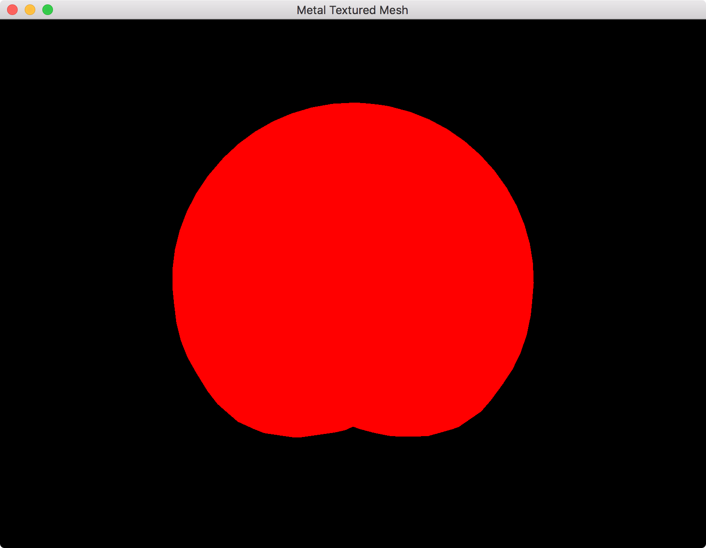

Finally, we combine all the information we've gathered so far and perform the lighting calculations. The depth test has already determined that these fragments are the fragments that can be seen by the camera and the stencil pass has allowed us to determine which fragments are actually within (and so affected by) the lights. As a result, the number of expensive lighting calculations we have to perform is minimized, helping us to improve our render performance.

The final result looks something like this:

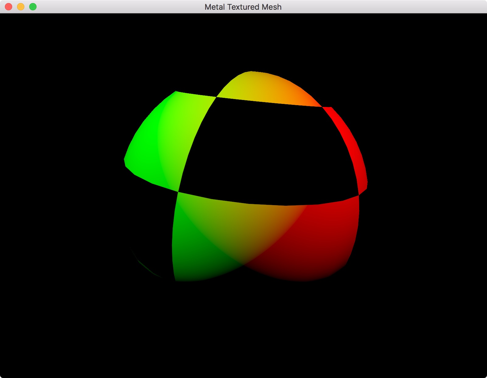

Implementation
==============

The concept is actually quite simple, implementing it can be a little tricky, especially when using a framework you're not familiar with.

*Disclaimer: There might be some bugs with this implementation that I haven't discovered yet.*

Note that I've tried to code this explicitly as I can, I've avoided encapsulating some of these things into functions so that you can see what's going on more clearly. I also do a nominal amount of error-checking.

To follow along with the rest of this tutorial, do the following:

-   Download the [sample code](https://developer.apple.com/library/content/samplecode/AdoptingMetalI/AdoptingMetalIApracticalapproachtoyourfirstMetalapp.zip) (I started with the sample code from [Apple's Adopting Metal I](https://developer.apple.com/library/content/samplecode/AdoptingMetalI/Introduction/Intro.html) sample).
-   Open the project in Xcode.
-   Click on the "Metal Textured Mesh" project in the Project Navigator.
-   Choose a development team under "General &gt; Signing".
-   Run the project

You should see a rotating cube with a checkerboard texture on a white background. You might also find it easier to follow along with the finished program in hand: [MetalDeferredLightingTutorial](https://github.com/sevanspowell/MetalDeferredLightingTutorial).

GBuffer pass
------------

### Albedo and depth

Let's setup our GBuffer pass. For now, we'll just render the scene albedo and depth.

We'll need a few resources to start us off:

**Renderer.swift**

``` swift
@objc
class Renderer : NSObject, MTKViewDelegate
{
    // ...
    var time = TimeInterval(0.0)
    var constants = Constants()

    var gBufferAlbedoTexture: MTLTexture
    var gBufferDepthTexture: MTLTexture
    let gBufferDepthStencilState: MTLDepthStencilState
    var gBufferRenderPassDescriptor: MTLRenderPassDescriptor
    let gBufferRenderPipeline: MTLRenderPipelineState

    init?(mtkView: MTKView) {
        // ...
        // To be used for the size of the render textures
        let drawableWidth = Int(self.view.drawableSize.width)
        let drawableHeight = Int(self.view.drawableSize.height)
        // We create our shaders from here
        let library = device.newDefaultLibrary()!

        // Create GBuffer albedo texture
        // First we create a descriptor that describes the texture we're about to create
        let gBufferAlbedoTextureDescriptor: MTLTextureDescriptor = MTLTextureDescriptor.texture2DDescriptor(pixelFormat: .rgba8Unorm, width: drawableWidth, height: drawableHeight, mipmapped: false)
        gBufferAlbedoTextureDescriptor.sampleCount = 1
        gBufferAlbedoTextureDescriptor.storageMode = .private
        gBufferAlbedoTextureDescriptor.textureType = .type2D
        gBufferAlbedoTextureDescriptor.usage = [.renderTarget, .shaderRead]

        // Then we make the texture
        gBufferAlbedoTexture = device.makeTexture(descriptor: gBufferAlbedoTextureDescriptor)

        // Create GBuffer depth texture
        let gBufferDepthDesc: MTLTextureDescriptor = MTLTextureDescriptor.texture2DDescriptor(pixelFormat: .depth32Float, width: drawableWidth, height: drawableHeight, mipmapped: false)
        gBufferDepthDesc.sampleCount = 1
        gBufferDepthDesc.storageMode = .private
        gBufferDepthDesc.textureType = .type2D
        gBufferDepthDesc.usage = [.renderTarget, .shaderRead]

        gBufferDepthTexture = device.makeTexture(descriptor: gBufferDepthDesc)

        // Build GBuffer depth/stencil state
        // Again we create a descriptor that describes the object we're about to create
        let gBufferDepthStencilStateDescriptor: MTLDepthStencilDescriptor = MTLDepthStencilDescriptor()
        gBufferDepthStencilStateDescriptor.isDepthWriteEnabled = true
        gBufferDepthStencilStateDescriptor.depthCompareFunction = .lessEqual
        gBufferDepthStencilStateDescriptor.frontFaceStencil = nil
        gBufferDepthStencilStateDescriptor.backFaceStencil = nil

        // Then we create the depth/stencil state
        gBufferDepthStencilState = device.makeDepthStencilState(descriptor: gBufferDepthStencilStateDescriptor)

        // Create GBuffer render pass descriptor
        gBufferRenderPassDescriptor = MTLRenderPassDescriptor()
        // Specify the properties of the first color attachment (our albedo texture)
        gBufferRenderPassDescriptor.colorAttachments[0].clearColor = MTLClearColorMake(0.0, 0.0, 0.0, 1.0)
        gBufferRenderPassDescriptor.colorAttachments[0].texture = gBufferAlbedoTexture
        gBufferRenderPassDescriptor.colorAttachments[0].loadAction = .clear
        gBufferRenderPassDescriptor.colorAttachments[0].storeAction = .store

        // Specify the properties of the depth attachment
        gBufferRenderPassDescriptor.depthAttachment.loadAction = .clear
        gBufferRenderPassDescriptor.depthAttachment.storeAction = .store
        gBufferRenderPassDescriptor.depthAttachment.texture = gBufferDepthTexture
        gBufferRenderPassDescriptor.depthAttachment.clearDepth = 1.0

        // Create GBuffer render pipeline
        let gBufferRenderPipelineDesc = MTLRenderPipelineDescriptor()
        gBufferRenderPipelineDesc.colorAttachments[0].pixelFormat = .rgba8Unorm
        gBufferRenderPipelineDesc.depthAttachmentPixelFormat = .depth32Float_stencil8
        gBufferRenderPipelineDesc.stencilAttachmentPixelFormat = .depth32Float_stencil8
        gBufferRenderPipelineDesc.sampleCount = 1
        gBufferRenderPipelineDesc.label = "GBuffer Render"
        gBufferRenderPipelineDesc.vertexFunction = library.makeFunction(name: "gBufferVert")
        gBufferRenderPipelineDesc.fragmentFunction = library.makeFunction(name: "gBufferFrag")
        do {
            try gBufferRenderPipeline = device.makeRenderPipelineState(descriptor: gBufferRenderPipelineDesc)
        } catch let error {
            fatalError("Failed to create GBuffer pipeline state, error \(error)")
        }

        super.init()

        // Now that all of our members are initialized, set ourselves as the drawing delegate of the view
        view.delegate = self
        view.device = device
    }
    // ...
}
```

You'll also want to add the following lines to your "Shaders.metal" file:

**Shaders.metal**


    struct GBufferOut {
        float4 albedo [[color(0)]];
    };

    vertex VertexOut gBufferVert(const device VertexIn *vertices [[buffer(0)]],
                                 const device Constants &uniforms [[buffer(1)]],
                                 unsigned int vid [[vertex_id]]) {
        VertexOut out;
        VertexIn vin = vertices[vid];

        float4 inPosition = float4(vin.position, 1.0);
        out.position = uniforms.modelViewProjectionMatrix * inPosition;
        float3 normal = vin.normal;
        float3 eyeNormal = normalize(uniforms.normalMatrix * normal);

        out.normal = eyeNormal;
        out.texCoords = vin.texCoords;

        return out;
    }

    fragment GBufferOut gBufferFrag(VertexOut in [[stage_in]],
                                    texture2d<float> albedo_texture [[texture(0)]])
    {
        // Sample from checkerboard texture
        constexpr sampler linear_sampler(min_filter::linear, mag_filter::linear);
        float4 albedo = albedo_texture.sample(linear_sampler, in.texCoords);

        GBufferOut output;

        // Output to our GBuffer albedo texture
        output.albedo = albedo;

        return output;
    }

To actually do anything with all this, we'll need to almost completely replace our render function:

**Renderer.swift**

``` swift
func render(_ view: MTKView) {
        // Our animation will be dependent on the frame time, so that regardless of how
        // fast we're animating, the speed of the transformations will be roughly constant.
        let timestep = 1.0 / TimeInterval(view.preferredFramesPerSecond)
        updateWithTimestep(timestep)

        // A command buffer is a container for the  work we want to perform with the GPU.
        let commandBuffer = commandQueue.makeCommandBuffer()

        // ---- GBUFFER ---- //
        // Draw our scene to texture
        // We use an encoder to 'encode' commands into a command buffer
        let gBufferEncoder = commandBuffer.makeRenderCommandEncoder(descriptor: gBufferRenderPassDescriptor)
        gBufferEncoder.pushDebugGroup("GBuffer") // For debugging
        gBufferEncoder.label = "GBuffer"
        // Use the depth stencil state we created earlier
        gBufferEncoder.setDepthStencilState(gBufferDepthStencilState)
        gBufferEncoder.setCullMode(.back)
        // Set winding order
        gBufferEncoder.setFrontFacing(.counterClockwise)
        // Use the render pipeline state we created earlier
        gBufferEncoder.setRenderPipelineState(gBufferRenderPipeline)
        // Upload vertex data
        gBufferEncoder.setVertexBuffer(mesh.vertexBuffer, offset:0, at:0)
        // Upload uniforms
        gBufferEncoder.setVertexBytes(&constants, length: MemoryLayout<Constants>.size, at: 1)
        // Bind the checkerboard texture (for the cube)
        gBufferEncoder.setFragmentTexture(texture, at: 0)
        // Draw our mesh
        gBufferEncoder.drawIndexedPrimitives(type: mesh.primitiveType,
                                             indexCount: mesh.indexCount,
                                             indexType: mesh.indexType,
                                             indexBuffer: mesh.indexBuffer,
                                             indexBufferOffset: 0)
        gBufferEncoder.popDebugGroup() // For debugging
        // Finish encoding commands in this encoder
        gBufferEncoder.endEncoding()

        // ---- BLIT ---- //
        // A 'drawable' is essentially a render target that can be displayed on the screen
        let currDrawable = view.currentDrawable

        // Blit our texture to the screen
        let blitEncoder = commandBuffer.makeBlitCommandEncoder()
        blitEncoder.pushDebugGroup("Blit")

        // Create a region that covers the entire texture we want to blit to the screen
        let origin: MTLOrigin = MTLOriginMake(0, 0, 0)
        let size: MTLSize = MTLSizeMake(Int(self.view.drawableSize.width), Int(self.view.drawableSize.height), 1)

        // Encode copy command, copying from our albedo texture to the 'current drawable' texture
        blitEncoder.copy(from: gBufferAlbedoTexture, sourceSlice: 0, sourceLevel: 0, sourceOrigin: origin, sourceSize: size, to: (currDrawable?.texture)!, destinationSlice: 0, destinationLevel: 0, destinationOrigin: origin)

        blitEncoder.endEncoding()
        blitEncoder.popDebugGroup()

        if let drawable = currDrawable
        {
            // Display our drawable to the screen
            commandBuffer.present(drawable)
        }

        // Finish encoding commands
        commandBuffer.commit()
}
```

You should see the following image on screen:

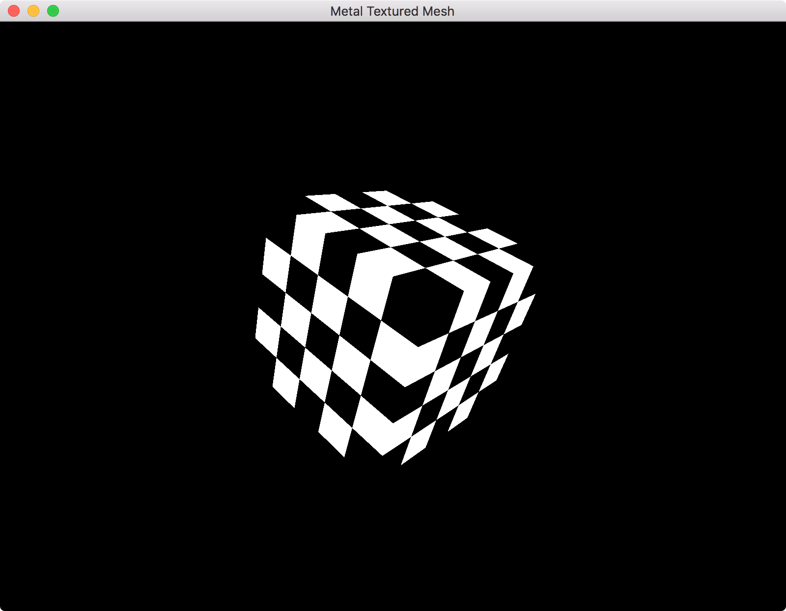

Great, that's step 1. Let's move on to rendering the normal and position data to a texture.

### Normal and position

First, the normal data. Add a normal texture to the renderer:

**Renderer.swift**

``` swift
// ...
var time = TimeInterval(0.0)
var constants = Constants()

var gBufferAlbedoTexture: MTLTexture
var gBufferDepthTexture: MTLTexture
let gBufferDepthStencilState: MTLDepthStencilState
var gBufferRenderPassDescriptor: MTLRenderPassDescriptor
let gBufferRenderPipeline: MTLRenderPipelineState

var gBufferNormalTexture: MTLTexture

init?(mtkView: MTKView) {
    // ...
    // Create GBuffer albedo texture
    // First we create a descriptor that describes the texture we're about to create
    let gBufferAlbedoTextureDescriptor: MTLTextureDescriptor = MTLTextureDescriptor.texture2DDescriptor(pixelFormat: .rgba8Unorm, width: drawableWidth, height: drawableHeight, mipmapped: false)
    gBufferAlbedoTextureDescriptor.sampleCount = 1
    gBufferAlbedoTextureDescriptor.storageMode = .private
    gBufferAlbedoTextureDescriptor.textureType = .type2D
    gBufferAlbedoTextureDescriptor.usage = [.renderTarget, .shaderRead]

    // Then we make the texture
    gBufferAlbedoTexture = device.makeTexture(descriptor: gBufferAlbedoTextureDescriptor)

    // Create GBuffer normal texture
    let gBufferNormalTextureDescriptor: MTLTextureDescriptor = MTLTextureDescriptor.texture2DDescriptor(pixelFormat: .rgba16Float, width: drawableWidth, height: drawableHeight, mipmapped: false)
    gBufferNormalTextureDescriptor.sampleCount = 1
    gBufferNormalTextureDescriptor.storageMode = .private
    gBufferNormalTextureDescriptor.textureType = .type2D
    gBufferNormalTextureDescriptor.usage = [.renderTarget, .shaderRead]

    gBufferNormalTexture = device.makeTexture(descriptor: gBufferNormalTextureDescriptor)

    // ...
    // Create GBuffer render pass descriptor
    gBufferRenderPassDescriptor = MTLRenderPassDescriptor()
    // Specify the properties of the first color attachment (our albedo texture)
    gBufferRenderPassDescriptor.colorAttachments[0].clearColor = MTLClearColorMake(0.0, 0.0, 0.0, 1.0)
    gBufferRenderPassDescriptor.colorAttachments[0].texture = gBufferAlbedoTexture
    gBufferRenderPassDescriptor.colorAttachments[0].loadAction = .clear
    gBufferRenderPassDescriptor.colorAttachments[0].storeAction = .store
    // Specify the properties of the second color attachment (our normal texture)
    gBufferRenderPassDescriptor.colorAttachments[1].clearColor = MTLClearColorMake(0, 0, 0, 1)
    gBufferRenderPassDescriptor.colorAttachments[1].texture = gBufferNormalTexture
    gBufferRenderPassDescriptor.colorAttachments[1].loadAction = .clear
    gBufferRenderPassDescriptor.colorAttachments[1].storeAction = .store

    // ...
    // Create GBuffer render pipeline
    let gBufferRenderPipelineDesc = MTLRenderPipelineDescriptor()
    gBufferRenderPipelineDesc.colorAttachments[0].pixelFormat = .rgba8Unorm
    // Add the following line to describe the pixel format of the normal texture
    gBufferRenderPipelineDesc.colorAttachments[1].pixelFormat = .rgba16Float
    gBufferRenderPipelineDesc.depthAttachmentPixelFormat = .depth32Float_stencil8
    gBufferRenderPipelineDesc.stencilAttachmentPixelFormat = .depth32Float_stencil8
    gBufferRenderPipelineDesc.sampleCount = 1
    gBufferRenderPipelineDesc.label = "GBuffer Render"
    gBufferRenderPipelineDesc.vertexFunction = library.makeFunction(name: "gBufferVert")
    gBufferRenderPipelineDesc.fragmentFunction = library.makeFunction(name: "gBufferFrag")
    do {
        try gBufferRenderPipeline = device.makeRenderPipelineState(descriptor: gBufferRenderPipelineDesc)
    } catch let error {
        fatalError("Failed to create GBuffer pipeline state, error \(error)")
    }

    // ...
}
```

**Shaders.metal**

``` swift
// ...
  struct GBufferOut {
      float4 albedo [[color(0)]];
      float4 normal [[color(1)]]; // Add normal texture output
  };

// ...

fragment GBufferOut gBufferFrag(VertexOut in [[stage_in]],
                                texture2d<float> albedo_texture [[texture(0)]])
{
    constexpr sampler linear_sampler(min_filter::linear, mag_filter::linear);
    float4 albedo = albedo_texture.sample(linear_sampler, in.texCoords);

    GBufferOut output;

    output.albedo = albedo;
    output.normal = float4(in.normal, 1.0); // Add the following line to the fragment function

    return output;
}
```

Now, change the blit copy command to copy from the normal texture, rather than the albedo texture. This will display the normal texture to the screen:

**Renderer.swift**

``` swift
func render(_ view: MTKView) {
  // ...
  blitEncoder.copy(from: gBufferNormalTexture, sourceSlice: 0, sourceLevel: 0, sourceOrigin: origin, sourceSize: size, to: (currDrawable?.texture)!, destinationSlice: 0, destinationLevel: 0, destinationOrigin: origin)
  // ...
}
```

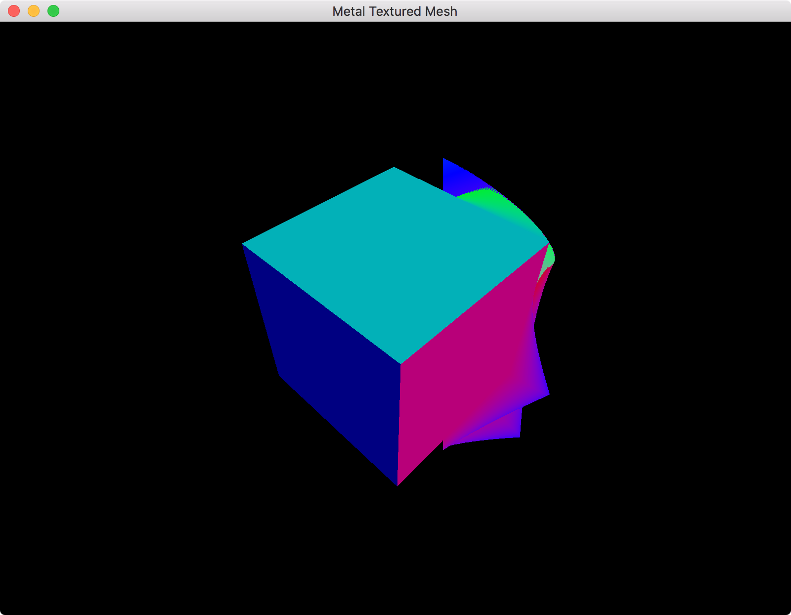

You might notice some artifacts, this has to do with the fact that we're blitting a 16-bit float directly to an 8-bit drawable texture. You can replace ".rgba16Float" to ".rgba8Unorm" in your code to confirm this.

**Renderer.swift**

``` swift
// ...
let gBufferNormalTextureDescriptor: MTLTextureDescriptor = MTLTextureDescriptor.texture2DDescriptor(pixelFormat: .rgba8Unorm, width: drawableWidth, height: drawableHeight, mipmapped: false)
// ...
gBufferRenderPipelineDesc.colorAttachments[1].pixelFormat = .rgba8Unorm
// ...
```

To finish up the GBuffer pass, let's render the world position of our scene to texture.

**Renderer.swift**

``` swift
@objc
class Renderer : NSObject, MTKViewDelegate
{
    // ...
    var gBufferAlbedoTexture: MTLTexture
    var gBufferNormalTexture: MTLTexture
    // Add position texture
    var gBufferPositionTexture: MTLTexture
    var gBufferDepthTexture: MTLTexture
    let gBufferDepthStencilState: MTLDepthStencilState
    var gBufferRenderPassDescriptor: MTLRenderPassDescriptor
    let gBufferRenderPipeline: MTLRenderPipelineState


    init?(mtkView: MTKView) {
        // ...
        // Create GBuffer normal texture
        let gBufferNormalTextureDescriptor: MTLTextureDescriptor = MTLTextureDescriptor.texture2DDescriptor(pixelFormat: .rgba16Float, width: drawableWidth, height: drawableHeight, mipmapped: false)
        gBufferNormalTextureDescriptor.sampleCount = 1
        gBufferNormalTextureDescriptor.storageMode = .private
        gBufferNormalTextureDescriptor.textureType = .type2D
        gBufferNormalTextureDescriptor.usage = [.renderTarget, .shaderRead]

        gBufferNormalTexture = device.makeTexture(descriptor: gBufferNormalTextureDescriptor)

        // Create GBuffer position texture
        let gBufferPositionTextureDescriptor: MTLTextureDescriptor = MTLTextureDescriptor.texture2DDescriptor(pixelFormat: .rgba16Float, width: drawableWidth, height: drawableHeight, mipmapped: false)
        gBufferPositionTextureDescriptor.sampleCount = 1
        gBufferPositionTextureDescriptor.storageMode = .private
        gBufferPositionTextureDescriptor.textureType = .type2D
        gBufferPositionTextureDescriptor.usage = [.renderTarget, .shaderRead]

        gBufferPositionTexture = device.makeTexture(descriptor: gBufferPositionTextureDescriptor)

        // ...

        // Create GBuffer render pass descriptor
        gBufferRenderPassDescriptor = MTLRenderPassDescriptor()
        // Specify the properties of the first color attachment (our albedo texture)
        gBufferRenderPassDescriptor.colorAttachments[0].clearColor = MTLClearColorMake(0.0, 0.0, 0.0, 1.0)
        gBufferRenderPassDescriptor.colorAttachments[0].texture = gBufferAlbedoTexture
        gBufferRenderPassDescriptor.colorAttachments[0].loadAction = .clear
        gBufferRenderPassDescriptor.colorAttachments[0].storeAction = .store
        // Specify the properties of the second color attachment (our normal texture)
        gBufferRenderPassDescriptor.colorAttachments[1].clearColor = MTLClearColorMake(0, 0, 0, 1)
        gBufferRenderPassDescriptor.colorAttachments[1].texture = gBufferNormalTexture
        gBufferRenderPassDescriptor.colorAttachments[1].loadAction = .clear
        gBufferRenderPassDescriptor.colorAttachments[1].storeAction = .store
        // Specify the properties of the third color attachment (our position texture)
        gBufferRenderPassDescriptor.colorAttachments[2].clearColor = MTLClearColorMake(0, 0, 0, 1)
        gBufferRenderPassDescriptor.colorAttachments[2].texture = gBufferPositionTexture
        gBufferRenderPassDescriptor.colorAttachments[2].loadAction = .clear
        gBufferRenderPassDescriptor.colorAttachments[2].storeAction = .store

        // ...

        // Create GBuffer render pipeline
        let gBufferRenderPipelineDesc = MTLRenderPipelineDescriptor()
        gBufferRenderPipelineDesc.colorAttachments[0].pixelFormat = .rgba8Unorm
        gBufferRenderPipelineDesc.colorAttachments[1].pixelFormat = .rgba16Float
        // Add this line to describe the pixel format of the position texture
        gBufferRenderPipelineDesc.colorAttachments[2].pixelFormat = .rgba16Float

        // ...
    }

    // ...
}
```

Again, we'll have to make a few adjustments to our shader. Things get a little bit more complicated.

**Shaders.metal**

``` swift
    // ...
    #include <metal_stdlib>
    using namespace metal;

    struct Constants {
        float4x4 modelViewProjectionMatrix;
        float3x3 normalMatrix;
        // Add space for a model matrix in our constants structs
        float4x4 modelMatrix;
    };

    // ...
    struct VertexOut {
        float4 position [[position]];
        float3 normal;
        float2 texCoords;
        // Add world position to our vertex shader out struct
        float4 worldPosition;
    };

    struct GBufferOut {
        float4 albedo [[color(0)]];
        float4 normal [[color(1)]];
        // Add another texture output to our GBuffer struct
        float4 position [[color(2)]];
    };

vertex VertexOut gBufferVert(const device VertexIn *vertices [[buffer(0)]],
                             const device Constants &uniforms [[buffer(1)]],
                             unsigned int vid [[vertex_id]]) {
    VertexOut out;
    VertexIn vin = vertices[vid];

    float4 inPosition = float4(vin.position, 1.0);
    out.position = uniforms.modelViewProjectionMatrix * inPosition;
    float3 normal = vin.normal;
    float3 eyeNormal = normalize(uniforms.normalMatrix * normal);

    out.normal = eyeNormal;
    out.texCoords = vin.texCoords;
    // Calculate the world position of this vertex
    out.worldPosition = uniforms.modelMatrix * inPosition;

    return out;
}

fragment GBufferOut gBufferFrag(VertexOut in [[stage_in]],
                                texture2d<float> albedo_texture [[texture(0)]])
{
    constexpr sampler linear_sampler(min_filter::linear, mag_filter::linear);
    float4 albedo = albedo_texture.sample(linear_sampler, in.texCoords);

    GBufferOut output;

    output.albedo = albedo;
    output.normal = float4(in.normal, 1.0);
    // Output this fragment's world position
    output.position = in.worldPosition;

    return output;
}
```

Because we changed the Constants struct in the shader, we'll have to change it in 'Renderer.swift' too:

**Renderer.swift**

``` swift
// ...
import Metal
import simd
import MetalKit

struct Constants {
    var modelViewProjectionMatrix = matrix_identity_float4x4
    var normalMatrix = matrix_identity_float3x3
    // Add model matrix to Constants struct
    var modelMatrix = matrix_identity_float4x4
}

// ...
```

We also need to make sure that we update the model matrix for the cube.

**Renderer.swift**

``` swift
func updateWithTimestep(_ timestep: TimeInterval)
{
    // We keep track of time so we can animate the various transformations
    time = time + timestep
    let modelToWorldMatrix = matrix4x4_rotation(Float(time) * 0.5, vector_float3(0.7, 1, 0))

    // So that the figure doesn't get distorted when the window changes size or rotates,
    // we factor the current aspect ration into our projection matrix. We also select
    // sensible values for the vertical view angle and the distances to the near and far planes.
    let viewSize = self.view.bounds.size
    let aspectRatio = Float(viewSize.width / viewSize.height)
    let verticalViewAngle = radians_from_degrees(65)
    let nearZ: Float = 0.1
    let farZ: Float = 100.0
    let projectionMatrix = matrix_perspective(verticalViewAngle, aspectRatio, nearZ, farZ)

    let viewMatrix = matrix_look_at(0, 0, 2.5, 0, 0, 0, 0, 1, 0)

    // The combined model-view-projection matrix moves our vertices from model space into clip space
    let mvMatrix = matrix_multiply(viewMatrix, modelToWorldMatrix);
    constants.modelViewProjectionMatrix = matrix_multiply(projectionMatrix, mvMatrix)
    constants.normalMatrix = matrix_inverse_transpose(matrix_upper_left_3x3(mvMatrix))

    // Make sure to update model matrix
    constants.modelMatrix = modelToWorldMatrix
}
```

Finally, we can change our blit copy command to copy from the position texture and view the results. Again, you will notice some artifacts and again you can temporarily change the format of the texture to "rgba8Unorm" to avoid these artifacts.

**Renderer.swift**

``` swift
func render(_ view: MTKView) {
  // ...
  blitEncoder.copy(from: gBufferPositionTexture, sourceSlice: 0, sourceLevel: 0, sourceOrigin: origin, sourceSize: size, to: (currDrawable?.texture)!, destinationSlice: 0, destinationLevel: 0, destinationOrigin: origin)
  // ...
}
```

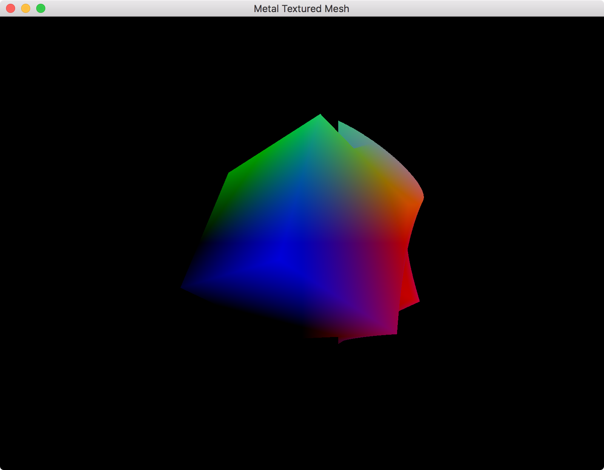

Great! We've finished rendering the GBuffer data from our scene. Now onto the stencil pass.

Stencil pass
------------

### Prepare the light volumes

Before we can render any lights, we need to prepare the meshes that will represent the light volumes. For now we're only going to represent point lights using spheres. It's possible to represent other light types using different volumes (e.g. represent directional lights using a quad that covers the entire screen).

The easiest way to do this is to modify the Mesh class that is included in the example:

**Mesh.swift**

``` swift
// ...
class Mesh {
    var vertexBuffer: MTLBuffer
    var vertexDescriptor: MTLVertexDescriptor
    var primitiveType: MTLPrimitiveType
    var indexBuffer: MTLBuffer
    var indexCount: Int
    var indexType: MTLIndexType

    init?(cubeWithSize size: Float, device: MTLDevice)
    {
        // ...
    }

    // Add a new init method for spheres
    init?(sphereWithSize size: Float, device: MTLDevice)
    {
        let allocator = MTKMeshBufferAllocator(device: device)

        let mdlMesh = MDLMesh(sphereWithExtent: vector_float3(size, size, size), segments: vector_uint2(30, 30), inwardNormals: false, geometryType: .triangles, allocator: allocator)

        do {
            let mtkMesh = try MTKMesh(mesh: mdlMesh, device: device)
            let mtkVertexBuffer = mtkMesh.vertexBuffers[0]
            let submesh = mtkMesh.submeshes[0]
            let mtkIndexBuffer = submesh.indexBuffer

            vertexBuffer = mtkVertexBuffer.buffer
            vertexBuffer.label = "Mesh Vertices"

            vertexDescriptor = MTKMetalVertexDescriptorFromModelIO(mdlMesh.vertexDescriptor)
            primitiveType = submesh.primitiveType
            indexBuffer = mtkIndexBuffer.buffer
            indexBuffer.label = "Mesh Indices"

            indexCount = submesh.indexCount
            indexType = submesh.indexType
        } catch _ {
            return nil // Unable to create MTK mesh from MDL mesh
        }
    }
}
```

Now we can create a light volume mesh in our renderer:

**Renderer.swift**

``` swift
// ...
let gBufferRenderPipeline: MTLRenderPipelineState

let lightSphere: Mesh

init?(mtkView: MTKView) {
    // ...
    // Make a unit sphere, we'll scale each light volume by it's radius in the vertex shader
    lightSphere = Mesh(sphereWithSize: 1.0, device: device)!

    super.init()

    // Now that all of our members are initialized, set ourselves as the drawing delegate of the view
    view.delegate = self
    view.device = device
}
```

And add a number of properties for our lights:

**Renderer.swift**

``` swift
  // ...
  struct Constants {
      var modelViewProjectionMatrix = matrix_identity_float4x4
      var normalMatrix = matrix_identity_float3x3
      var modelMatrix = matrix_identity_float4x4
  }

  struct PointLight {
      var worldPosition = float3(0.0, 0.0, 0.0)
      var radius = Float(1.0)
  }

  @objc
  class Renderer : NSObject, MTKViewDelegate
  {
      // ...
      let lightSphere: Mesh

      let lightNumber = 2
      var lightConstants = [Constants]()
      var lightProperties = [PointLight]()
}

init?(mtkView: MTKView) {
  // ...
  lightSphere = Mesh(sphereWithSize: 1.0, device: device)!

  // Add space for each light's data
  for _ in 0...(lightNumber - 1) {
      lightProperties.append(PointLight())
      lightConstants.append(Constants())
  }

  // Hard-code position and radius
  lightProperties[0].worldPosition = float3(0.0, 0.4, 0.0)
  lightProperties[0].radius = 0.7

  lightProperties[1].worldPosition = float3(-0.4, 0.0, 0.0)
  lightProperties[1].radius = 0.6

  super.init()

  // Now that all of our members are initialized, set ourselves as the drawing delegate of the view
  view.delegate = self
  view.device = device
}
```

Before we do anything further, let's render these lights in the GBuffer pass so that we can ensure they're working as we'd expect.

**Renderer.swift**

``` swift
// ...
func updateWithTimestep(_ timestep: TimeInterval)
{
    // ...

    // Update light constants
    for i in 0...(lightNumber-1) {
        let lightModelToWorldMatrix = matrix_multiply(matrix4x4_translation(lightProperties[i].worldPosition.x, lightProperties[i].worldPosition.y, lightProperties[i].worldPosition.z), matrix4x4_scale(vector3(lightProperties[i].radius, lightProperties[i].radius, lightProperties[i].radius)))
        let lightMvMatrix = matrix_multiply(viewMatrix, lightModelToWorldMatrix);
        lightConstants[i].modelViewProjectionMatrix = matrix_multiply(projectionMatrix, lightMvMatrix)
        lightConstants[i].normalMatrix = matrix_inverse_transpose(matrix_upper_left_3x3(lightMvMatrix))
        lightConstants[i].modelMatrix = lightModelToWorldMatrix;
    }
}

func render(_ view: MTKView) {
    // ...

    // ---- GBUFFER ---- //
    // Draw our scene to texture
    // We use an encoder to 'encode' commands into a command buffer
    let gBufferEncoder = commandBuffer.makeRenderCommandEncoder(descriptor: gBufferRenderPassDescriptor)
    gBufferEncoder.pushDebugGroup("GBuffer") // For debugging
    gBufferEncoder.label = "GBuffer"
    // Use the depth stencil state we created earlier
    gBufferEncoder.setDepthStencilState(gBufferDepthStencilState)
    gBufferEncoder.setCullMode(.back)
    // Set winding order
    gBufferEncoder.setFrontFacing(.counterClockwise)
    // Use the render pipeline state we created earlier
    gBufferEncoder.setRenderPipelineState(gBufferRenderPipeline)
    // Upload vertex data
    gBufferEncoder.setVertexBuffer(mesh.vertexBuffer, offset:0, at:0)
    // Upload uniforms
    gBufferEncoder.setVertexBytes(&constants, length: MemoryLayout<Constants>.size, at: 1)
    // Bind the checkerboard texture (for the cube)
    gBufferEncoder.setFragmentTexture(texture, at: 0)
    // Draw our mesh
    gBufferEncoder.drawIndexedPrimitives(type: mesh.primitiveType,
                                         indexCount: mesh.indexCount,
                                         indexType: mesh.indexType,
                                         indexBuffer: mesh.indexBuffer,
                                         indexBufferOffset: 0)
    // Draw our light meshes
    // Upload light vertex data
    gBufferEncoder.setVertexBuffer(lightSphere.vertexBuffer, offset:0, at:0)
    for i in 0...(lightNumber - 1) {
        // Upload uniforms
        gBufferEncoder.setVertexBytes(&lightConstants[i], length: MemoryLayout<Constants>.size, at: 1)
        gBufferEncoder.drawIndexedPrimitives(type: lightSphere.primitiveType,
                                              indexCount: lightSphere.indexCount,
                                              indexType: lightSphere.indexType,
                                              indexBuffer: lightSphere.indexBuffer,
                                              indexBufferOffset: 0)
    }
    gBufferEncoder.popDebugGroup() // For debugging
    // Finish encoding commands in this encoder
    gBufferEncoder.endEncoding()

    // ...
}
```

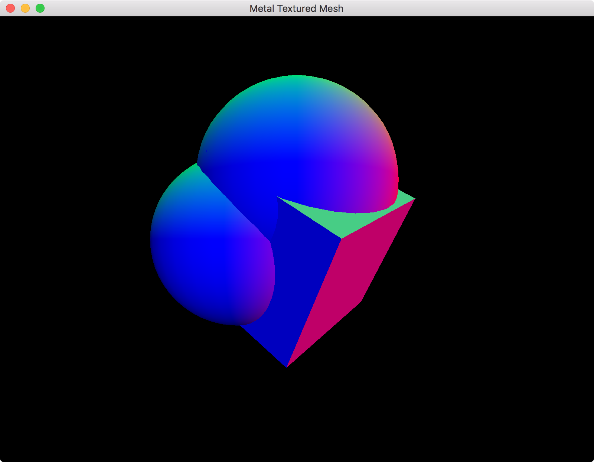

Looks alright to me! Note that I'm visualizing the normals in the above image.

When you're happy with the light volumes, remove them from the above drawing code.

### Make the stencil pass

Let's start with the shaders:

**Shaders.metal**

    struct StencilPassOut {
        float4 position [[position]];
    };

    vertex StencilPassOut stencilPassVert(const device VertexIn *vertices [[buffer(0)]],
                                          const device Constants &uniforms [[buffer(1)]],
                                          unsigned int vid [[vertex_id]]) {
        StencilPassOut out;

        out.position = uniforms.modelViewProjectionMatrix * float4(vertices[vid].position, 1.0);

        return out;
    }

    fragment void stencilPassNullFrag(StencilPassOut in [[stage_in]])
    {
    }

Note that the fragment shader doesn't output anything, it has no need to. This pass will only populate the stencil buffer.

Instead of creating a new texture for our stencil buffer, let's piggyback on an existing one:

**Renderer.swift**

``` swift
init?(mtkView: MTKView) {
  // ...

  // Create GBuffer depth (and stencil) texture
  let gBufferDepthDesc: MTLTextureDescriptor = MTLTextureDescriptor.texture2DDescriptor(pixelFormat: .depth32Float_stencil8, width: drawableWidth, height: drawableHeight, mipmapped: false)
  gBufferDepthDesc.sampleCount = 1
  gBufferDepthDesc.storageMode = .private
  gBufferDepthDesc.textureType = .type2D
  gBufferDepthDesc.usage = [.renderTarget, .shaderRead]

  gBufferDepthTexture = device.makeTexture(descriptor: gBufferDepthDesc)

  // ...
}
```

Ok, next we'll need to configure the behaviour of the stencil pass:

**Renderer.swift**

``` swift
// ...
let stencilPassDepthStencilState: MTLDepthStencilState
let stencilRenderPassDescriptor: MTLRenderPassDescriptor
let stencilRenderPipeline: MTLRenderPipelineState

init?(mtkView: MTKView) {
    // ...

    /* Be very careful with these operations, I clear the stencil buffer to a value of 0, so it's
     * very important that I set the depthFailureOperation to 'decrementWRAP' and 'incrementWRAP'
     * for the front and back face stencil operations (respectively) rather than 'decrementClamp'
     * and 'incrementClamp'. This is because we don't know in which order these operations will
     * occur. Let's say we use clamping:
     *
     * - Back then front order - two failures, expected stencil buffer value: 0
     * - Stencil buffer starts at 0
     * - Back face depth test fails first: stencil buffer incremented to 1
     * - Front face depth test fails second: stencil buffer decremented to 0
     * - Stencil buffer final value = 0 (== expected value) - all good!
     *
     * - Front then back order - two failures, expected stencil buffer value: 0
     * - Stencil buffer starts at 0
     * - Front face depth test fails first: stencil buffer decremented and clamped to 0
     * - Back face depth test fails second: stencil buffer incremented to 1
     * - Stencil buffer final value = 1 (!= expected value) - problem here!
     *
     * Wrapping does not have this issue. There are of course other ways to avoid this problem.
     */
    // Decrement when front faces depth fail
    let frontFaceStencilOp: MTLStencilDescriptor = MTLStencilDescriptor()
    frontFaceStencilOp.stencilCompareFunction = .always        // Stencil test always succeeds, only concerned about depth test
    frontFaceStencilOp.stencilFailureOperation = .keep         // Stencil test always succeeds
    frontFaceStencilOp.depthStencilPassOperation = .keep       // Do nothing if depth test passes
    frontFaceStencilOp.depthFailureOperation = .decrementWrap // Decrement if depth test fails

    // Increment when back faces depth fail
    let backFaceStencilOp: MTLStencilDescriptor = MTLStencilDescriptor()
    backFaceStencilOp.stencilCompareFunction = .always        // Stencil test always succeeds, only concerned about depth test
    backFaceStencilOp.stencilFailureOperation = .keep         // Stencil test always succeeds
    backFaceStencilOp.depthStencilPassOperation = .keep       // Do nothing if depth test passes
    backFaceStencilOp.depthFailureOperation = .incrementWrap // Increment if depth test fails

    let stencilPassDepthStencilStateDesc: MTLDepthStencilDescriptor = MTLDepthStencilDescriptor()
    stencilPassDepthStencilStateDesc.isDepthWriteEnabled = false           // Only concerned with modifying stencil buffer
    stencilPassDepthStencilStateDesc.depthCompareFunction = .lessEqual     // Only perform stencil op when depth function fails
    stencilPassDepthStencilStateDesc.frontFaceStencil = frontFaceStencilOp // For front-facing polygons
    stencilPassDepthStencilStateDesc.backFaceStencil = backFaceStencilOp   // For back-facing polygons
    stencilPassDepthStencilState = device.makeDepthStencilState(descriptor: stencilPassDepthStencilStateDesc)

    let stencilRenderPipelineDesc = MTLRenderPipelineDescriptor()
    stencilRenderPipelineDesc.label = "Stencil Pipeline"
    stencilRenderPipelineDesc.sampleCount = view.sampleCount
    stencilRenderPipelineDesc.vertexFunction = library.makeFunction(name: "stencilPassVert")
    stencilRenderPipelineDesc.fragmentFunction = library.makeFunction(name: "stencilPassNullFrag")
    stencilRenderPipelineDesc.depthAttachmentPixelFormat = .depth32Float_stencil8
    stencilRenderPipelineDesc.stencilAttachmentPixelFormat = .depth32Float_stencil8
    do {
        try stencilRenderPipeline = device.makeRenderPipelineState(descriptor: stencilRenderPipelineDesc)
    } catch let error {
        fatalError("Failed to create Stencil pipeline state, error \(error)")
    }

    stencilRenderPassDescriptor = MTLRenderPassDescriptor()
    stencilRenderPassDescriptor.depthAttachment.loadAction = .load      // Load up depth information from GBuffer pass
    stencilRenderPassDescriptor.depthAttachment.storeAction = .store    // We'll use depth information in later passes
    stencilRenderPassDescriptor.depthAttachment.texture = gBufferDepthTexture
    stencilRenderPassDescriptor.stencilAttachment.loadAction = .clear   // Contents of stencil buffer unkown at this point, clear it
    stencilRenderPassDescriptor.stencilAttachment.storeAction = .store  // Store the stencil buffer so that the next pass can use it
    stencilRenderPassDescriptor.stencilAttachment.texture = gBufferDepthTexture

    super.init()

    // Now that all of our members are initialized, set ourselves as the drawing delegate of the view
    view.delegate = self
    view.device = device
}
```

Finally, we do the stencil pass:

**Renderer.swift**

``` swift
func render(_ view: MTKView) {
    // ...

    // ---- GBUFFER ---- //
    // Draw our scene to texture
    // We use an encoder to 'encode' commands into a command buffer
    let gBufferEncoder = commandBuffer.makeRenderCommandEncoder(descriptor: gBufferRenderPassDescriptor)
    gBufferEncoder.pushDebugGroup("GBuffer") // For debugging
    gBufferEncoder.label = "GBuffer"
    // Use the depth stencil state we created earlier
    gBufferEncoder.setDepthStencilState(gBufferDepthStencilState)
    gBufferEncoder.setCullMode(.back)
    // Set winding order
    gBufferEncoder.setFrontFacing(.counterClockwise)
    // Use the render pipeline state we created earlier
    gBufferEncoder.setRenderPipelineState(gBufferRenderPipeline)
    // Upload vertex data
    gBufferEncoder.setVertexBuffer(mesh.vertexBuffer, offset:0, at:0)
    // Upload uniforms
    gBufferEncoder.setVertexBytes(&constants, length: MemoryLayout<Constants>.size, at: 1)
    // Bind the checkerboard texture (for the cube)
    gBufferEncoder.setFragmentTexture(texture, at: 0)
    // Draw our mesh
    gBufferEncoder.drawIndexedPrimitives(type: mesh.primitiveType,
                                          indexCount: mesh.indexCount,
                                          indexType: mesh.indexType,
                                          indexBuffer: mesh.indexBuffer,
                                          indexBufferOffset: 0)
    gBufferEncoder.popDebugGroup() // For debugging
    // Finish encoding commands in this encoder
    gBufferEncoder.endEncoding()

    // ---- STENCIL ---- //
    let stencilPassEncoder = commandBuffer.makeRenderCommandEncoder(descriptor: stencilRenderPassDescriptor)
    stencilPassEncoder.pushDebugGroup("Stencil Pass")
    stencilPassEncoder.label = "Stencil Pass"
    stencilPassEncoder.setDepthStencilState(stencilPassDepthStencilState)
    // We want to draw back-facing AND front-facing polygons
    stencilPassEncoder.setCullMode(.none)
    stencilPassEncoder.setFrontFacing(.counterClockwise)
    stencilPassEncoder.setRenderPipelineState(stencilRenderPipeline)
    stencilPassEncoder.setVertexBuffer(lightSphere.vertexBuffer, offset:0, at:0)

    for i in 0...(lightNumber-1) {
        stencilPassEncoder.setVertexBytes(&lightConstants[i], length: MemoryLayout<Constants>.size, at: 1)
        stencilPassEncoder.drawIndexedPrimitives(type: lightSphere.primitiveType, indexCount: lightSphere.indexCount, indexType: lightSphere.indexType, indexBuffer: lightSphere.indexBuffer, indexBufferOffset: 0)
    }

    stencilPassEncoder.popDebugGroup()
    stencilPassEncoder.endEncoding()

    // ---- BLIT ---- //
    // Blit our texture to the screen
    let blitEncoder = commandBuffer.makeBlitCommandEncoder()
    blitEncoder.pushDebugGroup("Blit")

    // ...
}
```

Of course we won't see anything yet, we'll have to trust that the stencil buffer is filled for now.

Lighting pass
-------------

### A first pass

Let's start off with some simplified shaders for our lighting pass:

**Shaders.metal**

``` swift
// ...
vertex StencilPassOut stencilPassVert(const device VertexIn *vertices [[buffer(0)]],
                                      const device Constants &uniforms [[buffer(1)]],
                                      unsigned int vid [[vertex_id]]) {
    StencilPassOut out;

    out.position = uniforms.modelViewProjectionMatrix * float4(vertices[vid].position, 1.0);

    return out;
}

fragment void stencilPassNullFrag(StencilPassOut in [[stage_in]])
{
}

// Used to calculate texture sampling co-ordinates
struct LightFragmentInput {
    float2 screenSize;
};

fragment float4 lightVolumeFrag(StencilPassOut in [[stage_in]],
                                constant LightFragmentInput *lightData [[ buffer(0) ]],
                                texture2d<float> albedoTexture [[ texture(0) ]],
                                texture2d<float> normalsTexture [[ texture(1) ]],
                                texture2d<float> positionTexture [[ texture(2) ]])
{
    // We sample albedo, normals and position from the position of this fragment, normalized to be 0-1 within screen space
    float2 sampleCoords = in.position.xy / lightData->screenSize;

    constexpr sampler texSampler;

    // Multiply by 0.5 so we can see the lights blending
    float3 albedo = float3(0.5) * float3(albedoTexture.sample(texSampler, sampleCoords));

    // Gamma correct the texture
    float3 gammaCorrect = pow(albedo, (1.0/2.2));
    return float4(gammaCorrect, 1.0);
}
```

We can actually re-use the vertex shader from our stencil pass. In the fragment shader, we use the screen size to normalize the fragment position. The result of this calculation we use as the texture co-ordinates for our sampling of the various input textures from the GBuffer pass.

**Renderer.swift**

``` swift
// Add light fragment input struct
struct LightFragmentInput {
    var screenSize = float2(1, 1)
}

@objc
class Renderer : NSObject, MTKViewDelegate
{
  let lightSphere: Mesh
  let lightNumber = 2
  var lightConstants = [Constants]()
  var lightProperties = [PointLight]()
  // Add light fragment input property
  var lightFragmentInput = LightFragmentInput()

  let stencilPassDepthStencilState: MTLDepthStencilState
  let stencilRenderPassDescriptor: MTLRenderPassDescriptor
  let stencilRenderPipeline: MTLRenderPipelineState

    init?(mtkView: MTKView) {
      // ...

      lightFragmentInput.screenSize.x = Float(view.drawableSize.width)
      lightFragmentInput.screenSize.y = Float(view.drawableSize.height)

      super.init()

      // Now that all of our members are initialized, set ourselves as the drawing delegate of the view
      view.delegate = self
      view.device = device
    }
```

Now we can prepare the lighting pass:

**Renderer.swift**

``` swift
// ...
let lightVolumeDepthStencilState: MTLDepthStencilState
var lightVolumeRenderPassDescriptor: MTLRenderPassDescriptor = MTLRenderPassDescriptor()
let lightVolumeRenderPipeline: MTLRenderPipelineState
// The final texture we'll blit to the screen
var compositeTexture: MTLTexture

init?(mtkView: MTKView) {
    // ...
    lightFragmentInput.screenSize.x = Float(view.drawableSize.width)
    lightFragmentInput.screenSize.y = Float(view.drawableSize.height)

    // Create composite texture
    let compositeTextureDescriptor: MTLTextureDescriptor = MTLTextureDescriptor.texture2DDescriptor(pixelFormat: .bgra8Unorm, width: drawableWidth, height: drawableHeight, mipmapped: false)
    compositeTextureDescriptor.sampleCount = 1
    compositeTextureDescriptor.storageMode = .private
    compositeTextureDescriptor.textureType = .type2D
    compositeTextureDescriptor.usage = [.renderTarget]

    compositeTexture = device.makeTexture(descriptor: compositeTextureDescriptor)

    // Build light volume depth-stencil state
    let lightVolumeStencilOp: MTLStencilDescriptor = MTLStencilDescriptor()
    lightVolumeStencilOp.stencilCompareFunction = .notEqual           // Only pass if not equal to reference value (ref. value is 0 by default)
    lightVolumeStencilOp.stencilFailureOperation = .keep              // Don't modify stencil value at all
    lightVolumeStencilOp.depthStencilPassOperation = .keep
    lightVolumeStencilOp.depthFailureOperation = .keep                // Depth test is set to always succeed

    let lightVolumeDepthStencilStateDesc: MTLDepthStencilDescriptor = MTLDepthStencilDescriptor()
    lightVolumeDepthStencilStateDesc.isDepthWriteEnabled = false       // Don't modify depth buffer
    lightVolumeDepthStencilStateDesc.depthCompareFunction = .always // Stencil buffer will be used to determine if we should light this fragment, ignore depth value (always pass)
    lightVolumeDepthStencilStateDesc.backFaceStencil = lightVolumeStencilOp
    lightVolumeDepthStencilStateDesc.frontFaceStencil = lightVolumeStencilOp
    lightVolumeDepthStencilState = device.makeDepthStencilState(descriptor: lightVolumeDepthStencilStateDesc)

    // Build light volume render pass descriptor
    // Get current render pass descriptor instead
    lightVolumeRenderPassDescriptor = MTLRenderPassDescriptor()
    lightVolumeRenderPassDescriptor.colorAttachments[0].clearColor = MTLClearColorMake(0.0, 0.0, 0.0, 1)
    lightVolumeRenderPassDescriptor.colorAttachments[0].texture = compositeTexture
    lightVolumeRenderPassDescriptor.colorAttachments[0].loadAction = .clear
    lightVolumeRenderPassDescriptor.colorAttachments[0].storeAction = .store // Store for blitting
    lightVolumeRenderPassDescriptor.depthAttachment.clearDepth = 1.0
    // Aren't using depth
    /*
    lightVolumeRenderPassDescriptor.depthAttachment.loadAction = .load
    lightVolumeRenderPassDescriptor.depthAttachment.storeAction = .store
    lightVolumeRenderPassDescriptor.depthAttachment.texture = gBufferDepthTexture
    */
    lightVolumeRenderPassDescriptor.stencilAttachment.loadAction = .load
    lightVolumeRenderPassDescriptor.stencilAttachment.storeAction = .dontCare // Aren't using stencil buffer after this point
    lightVolumeRenderPassDescriptor.stencilAttachment.texture = gBufferDepthTexture

    // Build light volume render pipeline
    let lightVolumeRenderPipelineDesc = MTLRenderPipelineDescriptor()
    lightVolumeRenderPipelineDesc.colorAttachments[0].pixelFormat = .bgra8Unorm
    // We need to enable blending as each light volume is additive (it 'adds' to the contribution of the previous one)
    lightVolumeRenderPipelineDesc.colorAttachments[0].isBlendingEnabled = true
    lightVolumeRenderPipelineDesc.colorAttachments[0].rgbBlendOperation = .add
    lightVolumeRenderPipelineDesc.colorAttachments[0].sourceRGBBlendFactor = .one
    lightVolumeRenderPipelineDesc.colorAttachments[0].destinationRGBBlendFactor = .one
    lightVolumeRenderPipelineDesc.colorAttachments[0].alphaBlendOperation = .add
    lightVolumeRenderPipelineDesc.colorAttachments[0].sourceAlphaBlendFactor = .one
    lightVolumeRenderPipelineDesc.colorAttachments[0].destinationAlphaBlendFactor = .one
    lightVolumeRenderPipelineDesc.depthAttachmentPixelFormat = .depth32Float_stencil8
    lightVolumeRenderPipelineDesc.stencilAttachmentPixelFormat = .depth32Float_stencil8
    lightVolumeRenderPipelineDesc.sampleCount = 1
    lightVolumeRenderPipelineDesc.label = "Light Volume Render"
    lightVolumeRenderPipelineDesc.vertexFunction = library.makeFunction(name: "stencilPassVert")
    lightVolumeRenderPipelineDesc.fragmentFunction = library.makeFunction(name: "lightVolumeFrag")
    do {
        try lightVolumeRenderPipeline = device.makeRenderPipelineState(descriptor: lightVolumeRenderPipelineDesc)
    } catch let error {
        fatalError("Failed to create lightVolume pipeline state, error \(error)")
    }

    super.init()
    // ...
}
```

There's alot going on there, so read through it carefully.

Finally, let's perform the lighting pass:

**Renderer.swift**

``` swift
func render(_ view: MTKView) {
  // ...
  stencilPassEncoder.popDebugGroup()
  stencilPassEncoder.endEncoding()

  // ---- LIGHTING ---- //
  let lightEncoder = commandBuffer.makeRenderCommandEncoder(descriptor: lightVolumeRenderPassDescriptor)
  lightEncoder.pushDebugGroup("Light Volume Pass")
  lightEncoder.label = "Light Volume Pass"
  lightEncoder.setDepthStencilState(lightVolumeDepthStencilState)
  lightEncoder.setStencilReferenceValue(0)
  lightEncoder.setCullMode(.front)
  lightEncoder.setFrontFacing(.counterClockwise)
  lightEncoder.setRenderPipelineState(lightVolumeRenderPipeline)
  lightEncoder.setFragmentTexture(gBufferAlbedoTexture, at: 0)
  lightEncoder.setFragmentTexture(gBufferNormalTexture, at: 1)
  lightEncoder.setFragmentTexture(gBufferPositionTexture, at: 2)
  lightEncoder.setVertexBuffer(lightSphere.vertexBuffer, offset:0, at:0)
  lightEncoder.setFragmentBytes(&lightFragmentInput, length: MemoryLayout<LightFragmentInput>.size, at: 0)
  for i in 0...(lightNumber - 1) {
      lightEncoder.setVertexBytes(&lightConstants[i], length: MemoryLayout<Constants>.size, at: 1)
      lightEncoder.drawIndexedPrimitives(type: lightSphere.primitiveType, indexCount: lightSphere.indexCount, indexType: lightSphere.indexType, indexBuffer: lightSphere.indexBuffer, indexBufferOffset: 0)
  }

  lightEncoder.popDebugGroup()
  lightEncoder.endEncoding()
}
```

We also need to blit the final composite texture to the screen.

**Renderer.swift**

``` swift
func render(_ view: MTKView) {
  // ...
  blitEncoder.copy(from: compositeTexture, sourceSlice: 0, sourceLevel: 0, sourceOrigin: origin, sourceSize: size, to: (currDrawable?.texture)!, destinationSlice: 0, destinationLevel: 0, destinationOrigin: origin)
  // ...
}
```

You should see something like this:

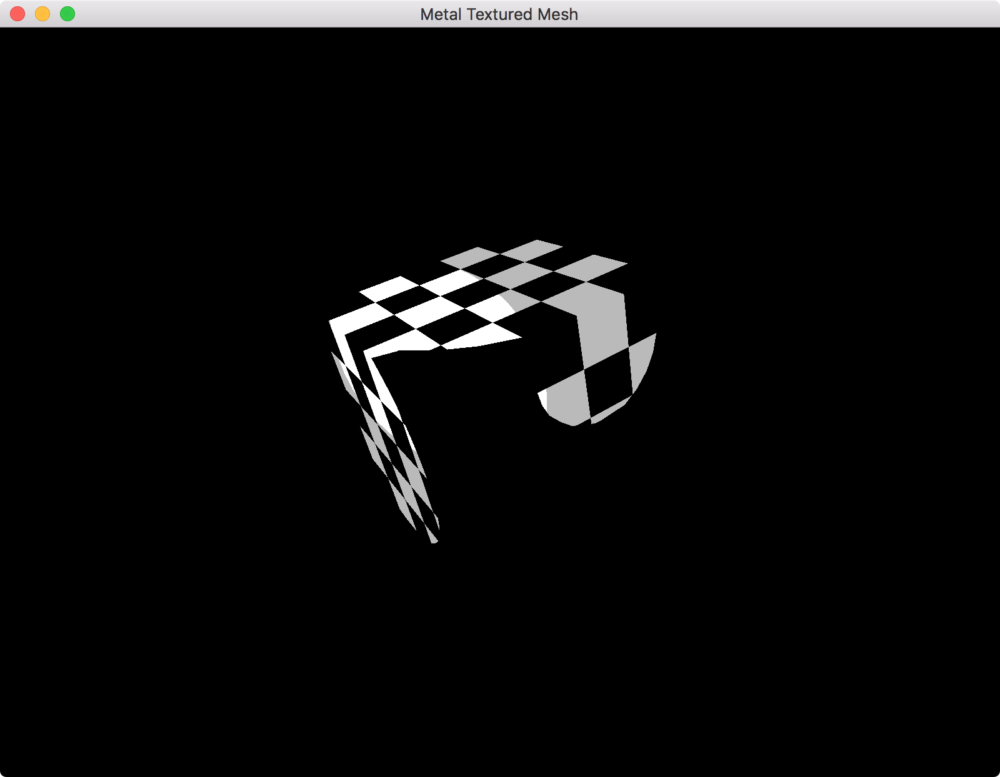

You can see the lights blending nicely in the middle. Notice how the side of the cube facing away from the lights is still getting shaded? That might seem erroneous but that case will be handled in our shaders, which won't shade triangles facing away from the light source.

Obviously these are not the kind of shaders you'd normally use, they're only for visualization purposes.

### Improving those shaders

We have all that information from the GBuffer available to us in our shaders, let's use it!

At this point I decided to change the cube mesh to a sphere so I could better see the effect of the lights. I also tweaked the light positions:

**Renderer.swift**

``` swift
init?(mtkView: MTKView) {
  // ...

  // Compile the functions and other state into a pipeline object.
  do {
      renderPipelineState = try Renderer.buildRenderPipelineWithDevice(device, view: mtkView)
  }
  catch {
      print("Unable to compile render pipeline state")
      return nil
  }

  mesh = Mesh(cubeWithSize: 1.0, device: device)!

  // ...

  // Hard-code position and radius
  lightProperties[0].worldPosition = float3(1, 1, 1.5)
  lightProperties[0].radius = 1.0

  lightProperties[1].worldPosition = float3(-0.4, 0.0, 0.0)
  lightProperties[1].radius = 1.0
}
```

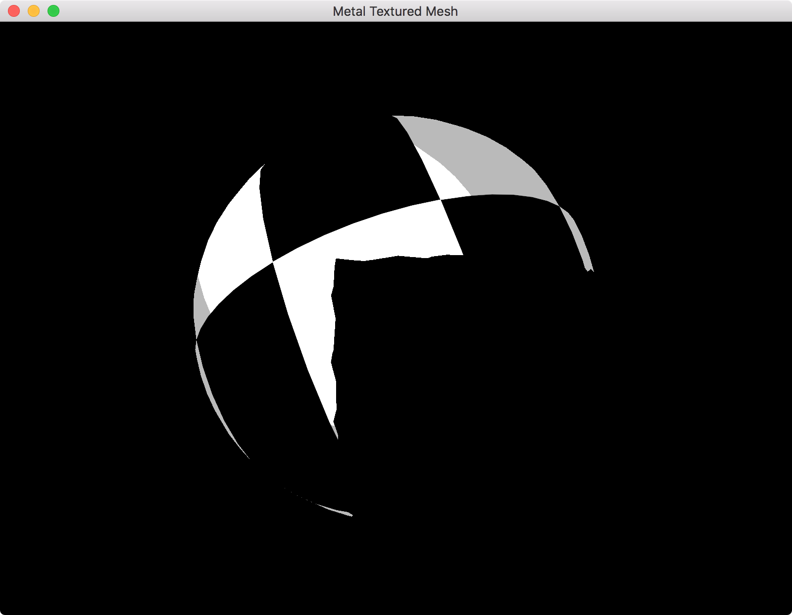

Notice the wobbly edges of the light volume? It looks like that because of the low number of segments we're using in our sphere mesh. You can increase the number of segments in your 'Mesh.swift' file, but they won't be noticable when we do the lighting calculations (lighting contributions at the edge of the light volume should approach 0).

I am hard-coding the radii here. You can calculate the radius of the sphere based on fall-off, but I think this article is big enough for now. A good explanation of how to calculate the radius of a light volume is given in [this](http://ogldev.atspace.co.uk/www/tutorial36/tutorial36.html) OGLDev tutorial.

**Shaders.metal**

``` swift
// ...
struct LightFragmentInput {
    float2 screenSize;
    // We're going to need the camera's position to calculate specular lighting
    float3 camWorldPos;
};

struct PointLight {
    float3 worldPosition;
    float radius;
    float3 color;
};

fragment float4 lightVolumeFrag(StencilPassOut in [[stage_in]],
                                constant LightFragmentInput *lightData [[ buffer(0) ]],
                                constant PointLight *pointLight [[ buffer(1) ]],
                                texture2d<float> albedoTexture [[ texture(0) ]],
                                texture2d<float> normalsTexture [[ texture(1) ]],
                                texture2d<float> positionTexture [[ texture(2) ]])
{
  // We sample albedo, normals and position from the position of this fragment, normalized to be 0-1 within screen space
  float2 sampleCoords = in.position.xy / lightData->screenSize;

  constexpr sampler texSampler;

  // Extract data for this fragment from GBuffer textures
  const float3 albedo = float3(albedoTexture.sample(texSampler, sampleCoords));
  const float3 worldPosition = float3(positionTexture.sample(texSampler, sampleCoords));
  const float3 normal = normalize(float3(normalsTexture.sample(texSampler, sampleCoords)));

  const float3 lightDir = normalize(pointLight->worldPosition - worldPosition);

  // Diffuse
  const float nDotL = max(dot(normal, lightDir), 0.0);
  const float3 diffuse = nDotL * albedo * pointLight->color;

  float3 result = diffuse;

  // Specular - if you want
  //const float3 viewDir = normalize(lightData->camWorldPos - worldPosition);
  //const float3 halfwayDir = normalize(lightDir + viewDir);
  //const float3 specular = pow(max(dot(normal, halfwayDir), 0.0), 60.0) * 0.2;
  //result = (diffuse + specular);

  const float3 gammaCorrect = pow(float3(result), (1.0/2.2));
  return float4(gammaCorrect, 1.0);
}
```

**Renderer.swift**

``` swift
struct PointLight {
    var worldPosition = float3(0.0, 0.0, 0.0)
    var radius = Float(1.0)
    var color = float3(1, 1, 1)
}

struct LightFragmentInput {
    var screenSize = float2(1, 1)
    var camWorldPos = float3(0.0, 0.0, 2.5)
}

@objc
class Renderer : NSObject, MTKViewDelegate
{
  // ...
  init?(mtkView: MTKView) {
    // ...

    // Add space for each light's data
    for _ in 0...(lightNumber - 1) {
        lightProperties.append(PointLight())
        lightConstants.append(Constants())
    }

    // Hard-code position, radius, color
    lightProperties[0].worldPosition = float3(1, 1, 1.5)
    lightProperties[0].radius = 3
    lightProperties[0].color = float3(1, 0, 0)

    lightProperties[1].worldPosition = float3(-1, 1, 1.5)
    lightProperties[1].radius = 3
    lightProperties[1].color = float3(0, 1, 0)
  }
}

// ...
func render(_ view: MTKView) {
  // ...

  // ---- LIGHTING ---- //
  let lightPassEncoder = commandBuffer.makeRenderCommandEncoder(descriptor: lightVolumeRenderPassDescriptor)
  lightPassEncoder.pushDebugGroup("Light Volume Pass")
  lightPassEncoder.label = "Light Volume Pass"
  // Use our previously configured depth stencil state
  lightPassEncoder.setDepthStencilState(lightVolumeDepthStencilState)
  // Set our stencil reference value to 0 (in the depth stencil state we configured fragments to pass only if they are NOT EQUAL to the reference value
  lightPassEncoder.setStencilReferenceValue(0)
  // We cull the front of the spherical light volume and not the back, in-case we are inside the light volume. I'm not 100% certain this is the best way to do this, but it seems to work.
  lightPassEncoder.setCullMode(.front)
  lightPassEncoder.setFrontFacing(.counterClockwise)
  lightPassEncoder.setRenderPipelineState(lightVolumeRenderPipeline)
  // Bind our GBuffer textures
  lightPassEncoder.setFragmentTexture(gBufferAlbedoTexture, at: 0)
  lightPassEncoder.setFragmentTexture(gBufferNormalTexture, at: 1)
  lightPassEncoder.setFragmentTexture(gBufferPositionTexture, at: 2)
  lightPassEncoder.setVertexBuffer(lightSphere.vertexBuffer, offset:0, at:0)
  // Upload our screen size
  lightPassEncoder.setFragmentBytes(&lightFragmentInput, length: MemoryLayout<LightFragmentInput>.size, at: 0)
  // Render light volumes
  for i in 0...(lightNumber - 1) {
      lightPassEncoder.setVertexBytes(&lightConstants[i], length: MemoryLayout<Constants>.size, at: 1)
      // Upload light property data too
      lightPassEncoder.setFragmentBytes(&lightProperties[i], length: MemoryLayout<PointLight>.size, at: 1)
      lightPassEncoder.drawIndexedPrimitives(type: lightSphere.primitiveType, indexCount: lightSphere.indexCount, indexType: lightSphere.indexType, indexBuffer: lightSphere.indexBuffer, indexBufferOffset: 0)
  }

  lightPassEncoder.popDebugGroup()
  lightPassEncoder.endEncoding()

  // ...
}
```

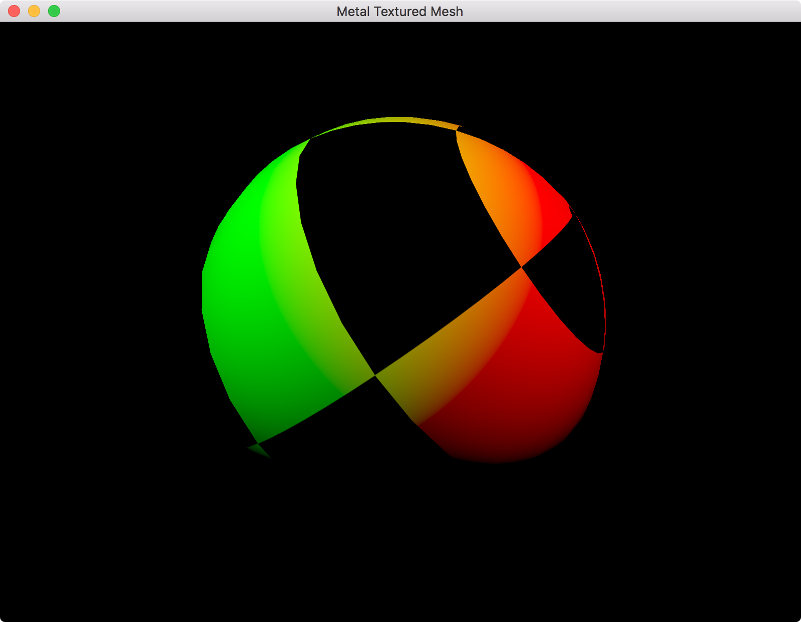

And another with no texture, so that you can see the lights better:

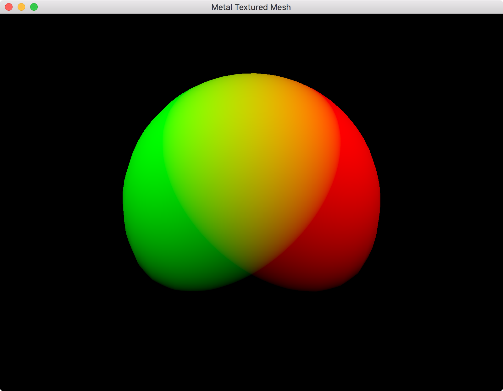

### An aside on gamma correction

Gamma correction, it's really important:

Further reading:

-   [GPU Gems 3: The Importance of Being Linear](http://http.developer.nvidia.com/GPUGems3/gpugems3_ch24.html)
-   [Coding Labs: Gamma and Linear Spaces](http://www.codinglabs.net/article_gamma_vs_linear.aspx)
-   [Gamasutra: Gamma-Correct Lighting](http://www.gamasutra.com/blogs/DavidRosen/20100204/4322/GammaCorrect_Lighting.php)

[*Thanks Marcin Ignac*](http://marcinignac.com/blog/pragmatic-pbr-setup-and-gamma/)

Handling window resizing
------------------------

Up to now, we haven't been handling resize events, let's fix this:

**Renderer.swift**

``` swift
@objc
class Renderer : NSObject, MTKViewDelegate
{
      // ...

      func mtkView(_ view: MTKView, drawableSizeWillChange size: CGSize) {
          // respond to resize
          let drawableWidth = Int(size.width)
          let drawableHeight = Int(size.height)

          lightFragmentInput.screenSize.x = Float(size.width)
          lightFragmentInput.screenSize.y = Float(size.height)

          // Create resized GBuffer albedo texture
          let gBufferAlbedoTextureDescriptor: MTLTextureDescriptor = MTLTextureDescriptor.texture2DDescriptor(pixelFormat: .rgba8Unorm, width: drawableWidth, height: drawableHeight, mipmapped: false)
          gBufferAlbedoTextureDescriptor.sampleCount = 1
          gBufferAlbedoTextureDescriptor.storageMode = .private
          gBufferAlbedoTextureDescriptor.textureType = .type2D
          gBufferAlbedoTextureDescriptor.usage = [.renderTarget, .shaderRead]

          gBufferAlbedoTexture = device.makeTexture(descriptor: gBufferAlbedoTextureDescriptor)

          // Create resized GBuffer normal texture
          let gBufferNormalTextureDescriptor: MTLTextureDescriptor = MTLTextureDescriptor.texture2DDescriptor(pixelFormat: .rgba16Float, width: drawableWidth, height: drawableHeight, mipmapped: false)
          gBufferNormalTextureDescriptor.sampleCount = 1
          gBufferNormalTextureDescriptor.storageMode = .private
          gBufferNormalTextureDescriptor.textureType = .type2D
          gBufferNormalTextureDescriptor.usage = [.renderTarget, .shaderRead]

          gBufferNormalTexture = device.makeTexture(descriptor: gBufferNormalTextureDescriptor)

          // Create resized GBuffer position texture
          let gBufferPositionTextureDescriptor: MTLTextureDescriptor = MTLTextureDescriptor.texture2DDescriptor(pixelFormat: .rgba16Float, width: drawableWidth, height: drawableHeight, mipmapped: false)
          gBufferPositionTextureDescriptor.sampleCount = 1
          gBufferPositionTextureDescriptor.storageMode = .private
          gBufferPositionTextureDescriptor.textureType = .type2D
          gBufferPositionTextureDescriptor.usage = [.renderTarget, .shaderRead]

          gBufferPositionTexture = device.makeTexture(descriptor: gBufferPositionTextureDescriptor)

          // Create resized GBuffer depth (and stencil) texture
          let gBufferDepthDesc: MTLTextureDescriptor = MTLTextureDescriptor.texture2DDescriptor(pixelFormat: .depth32Float_stencil8, width: drawableWidth, height: drawableHeight, mipmapped: false)
          gBufferDepthDesc.sampleCount = 1
          gBufferDepthDesc.storageMode = .private
          gBufferDepthDesc.textureType = .type2D
          gBufferDepthDesc.usage = [.renderTarget, .shaderRead]

          gBufferDepthTexture = device.makeTexture(descriptor: gBufferDepthDesc)

          // Create resized composite texture
          let compositeTextureDescriptor: MTLTextureDescriptor = MTLTextureDescriptor.texture2DDescriptor(pixelFormat: .bgra8Unorm, width: drawableWidth, height: drawableHeight, mipmapped: false)
          compositeTextureDescriptor.sampleCount = 1
          compositeTextureDescriptor.storageMode = .private
          compositeTextureDescriptor.textureType = .type2D
          compositeTextureDescriptor.usage = [.renderTarget]

          compositeTexture = device.makeTexture(descriptor: compositeTextureDescriptor)

          // Hook the new textures up to their descriptors
          gBufferRenderPassDescriptor.colorAttachments[0].texture = gBufferAlbedoTexture
          gBufferRenderPassDescriptor.colorAttachments[1].texture = gBufferNormalTexture
          gBufferRenderPassDescriptor.colorAttachments[2].texture = gBufferPositionTexture
          gBufferRenderPassDescriptor.depthAttachment.texture = gBufferDepthTexture

          stencilRenderPassDescriptor.depthAttachment.texture = gBufferDepthTexture
          stencilRenderPassDescriptor.stencilAttachment.texture = gBufferDepthTexture

          lightVolumeRenderPassDescriptor.colorAttachments[0].texture = compositeTexture
          lightVolumeRenderPassDescriptor.stencilAttachment.texture = gBufferDepthTexture
      }

      // ...
  }
```

Conclusion
==========

That demonstrates the core concepts of deferred shading. There's plenty more we could cover, but I'll save that for a future tutorial.

Related links
=============

-   [OGLDev - Deferred Shading Part 1](http://ogldev.atspace.co.uk/www/tutorial35/tutorial35.html)
-   [Learn OpenGL - Deferred Shading](https://learnopengl.com/#!Advanced-Lighting/Deferred-Shading)
-   [Coding Labs - Deferred Rendering](http://www.codinglabs.net/tutorial_simple_def_rendering.aspx)
-   [Marcin Ignac's Blog - Gamma and Lighting](http://marcinignac.com/blog/pragmatic-pbr-setup-and-gamma/)
-   [GPU Gems 3: The Importance of Being Linear](http://http.developer.nvidia.com/GPUGems3/gpugems3_ch24.html)
-   [Coding Labs: Gamma and Linear Spaces](http://www.codinglabs.net/article_gamma_vs_linear.aspx)
-   [Gamasutra: Gamma-Correct Lighting](http://www.gamasutra.com/blogs/DavidRosen/20100204/4322/GammaCorrect_Lighting.php)

[^ Back to Top](#top)
